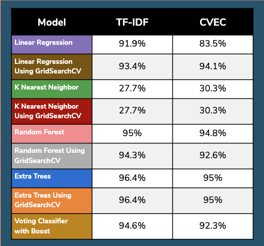
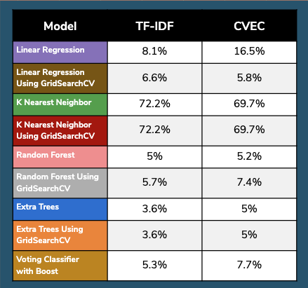
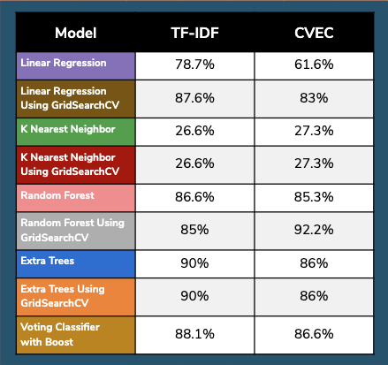
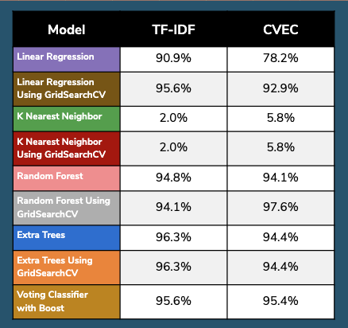
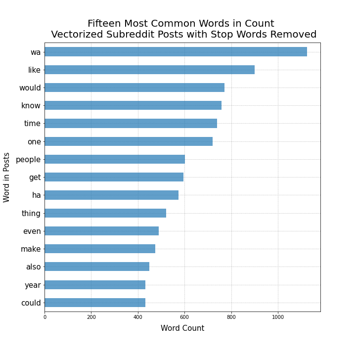
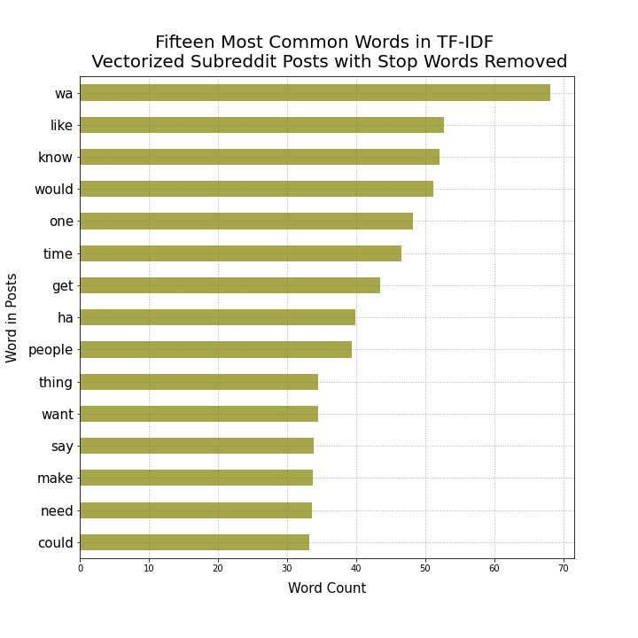
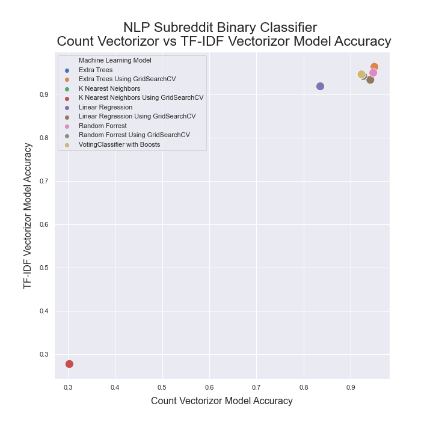
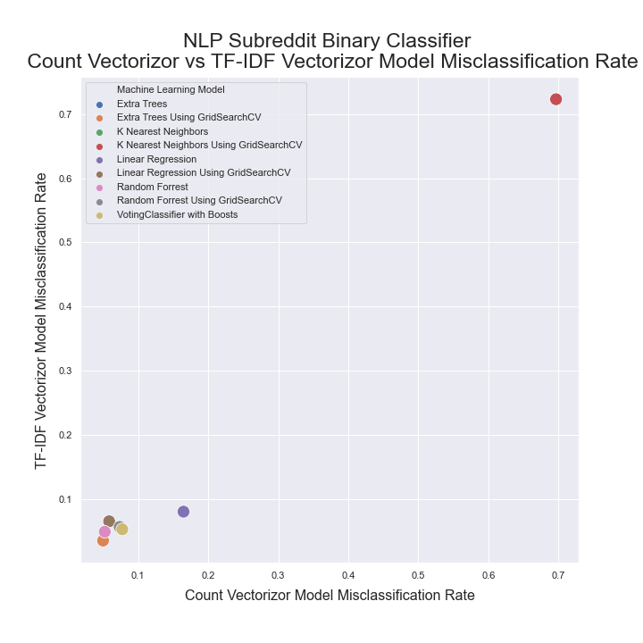
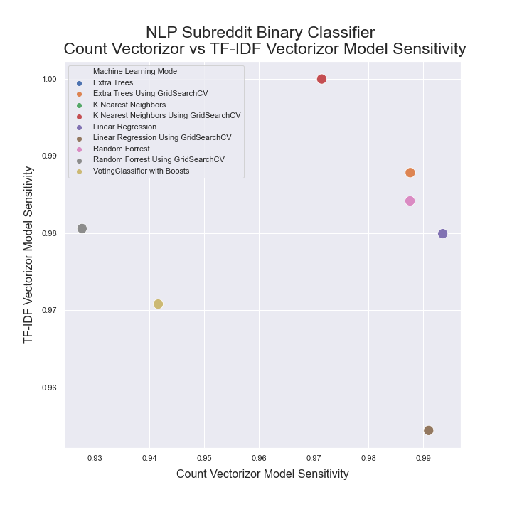

# Natural Language Processing Binary Classification for DadJoke subreddits


# Executive Summary


## Objective

This project's focus centers on Natural Language Processing in conjunction with data acquisition, gathering, and wrangling as well as it's analysis and use in modeling. The project relies on Classification Modeling, specifically the use of various models, means of assessment  and preprocessing associated with classification.

## The Situation

Oh no! My brother used my computer to get on reddit and now there are all a lot of subreddit pages open. I wonder if I could build a model that would predict a subreddit correctly if I gave it only the posts of all the subreddit pages he has open. He has the following subreddits open: **r/80sRock, r/DadJokes, r/Electricity, r/history, r/philosophy, r/rant, r/showerthoughts.**

## Problem Statement

Which model in my Natural Language Processing toolbox would best classify a post of a specific subreddit topic from a group of subreddit posts. I scraped 1,000 subreddit posts from each topic. I chose to classify for r/DadJokes.

## Data Collection, Cleaning, Preprocessing, and EDA

1000 posts from the following subreddit websites were scraped using the PRAW API on August 24th, 2020: **r/80sRock, r/DadJokes, r/Electricity, r/history, r/philosophy, r/rant, r/showerthoughts**. The posts were initially cleaned by the removal of empty post fields and the removal of special characters by a script before being exported as individual csv files per topic. The expoted topic csv files were used to create a concatenated dataframe which was cleaned further, including the removal of English stop words, then vectorized using either Count Vectorizor or TF-IDF vectorizer. The vectorized dataframes were exported as csvs then explored.

## Modeling

Five models were used to analized two discretely vectorized dataframes. These models included Linear Regression, K Nearest Neighbor, Random Forest, Extra Trees, Voting Classifier (with Boost), with four of the five models also run with the use of GridSearchCV.

Evaluation and Conceptual Understanding

A classification matrix was created from every fit model testing data. The classification matrix was then used to calculate classification metrics which were then visualized for comparison and evaluation.


## Project Directory

```
|--csv_model_statistics
		|--cvec_model_statistics_with_boost.csv
		|--cvec_model_statistics.csv
		|--tfidif_model_statistics_with_boost.csv
		|--tfidig_model_statistics.csv
|--csv_scrapes
		|--80sRock_subreddit.csv
		|--concatenated_subreddit.csv
		|--dadjokes_subreddit.csv
		|--Electricity_subreddit.csv
		|--history_subreddit.csv
		|--philosophy_subreddit.csv
		|--rant_subreddit.csv
		|--Showerthoughts_subreddit.csv
|--csv_vectorized
		|--subreddit_count_vec.csv
		|--subreddit_tfidif.csv
|--EDA.ipynb
|--model_visualizations.ipynb
|--models
		|--cvec_boost_model.ipynb
		|--cvec_models.ipnb
		|--tfidif_boost_model.ipynb
		|--tfidif_models.ipynb
|--nlp_bianary_classification_for_dadjoke_subreddits.pdf		
|--nlp_header.png
|--README.md
|--scrubbers
		|--body_scrape_to_stripped.ipynb
		|--concat_df_creator.ipynb
|--subreddit_scraper.ipynb
|--vectorizors
		|--subreddit_cvec.ipynb
		|--subreddit_tfidf.ipynb
|--visualization_images
		|--accuracy_metrics.png
		|--classifier_accuracy.png
		|--classifier_misclassification.png
		|--classifier_precision.png
		|--classifier_sensitivity.png
		|--classifier_specificity.png
		|--misclassification_rate_metrics.png
		|--most_common_cvec.png
		|--most_common_tfidf.png
		|--precision_metrics.png
		|--sensitivity_metrics.png
		|--specificity_metrics.png
```


## Directory Workflow

1. subreddit_scraper.ipynb contains and API which was used to scrape subreddits from reddit.com. Through the use of a function, the scraped posts were cleaned of empty post bodies and special characters. Csv files were created and stored in the csv_scrapes directory after initial processing.
2. The scrubbers directory contains notebooks with functions that were used to further clean the data in each subtopic csv then all the subreddit csv's were concatenated into a single csv. The final concatenated csv was stored in the csv_scrapes directory.
3. The concatenated csv was vectorized using CountVectorizor and TF-IDF vectorizer both contained in .ipynb notebooks within the scrubbers directory. The vectorized dataframes were stored as csv files in the csv_vectorized directory.
4. The vectorized data from the csv_vectorized directory were modeled using the .ipynb notebooks in the models directory with the resulting statistics saved as csv files in the csv_model_statistics directory.
5. The model statistics csvs were used to create models in the models_visualizations.ipy0nb notebook with the resulting statistic visualizations saved in the visualization_images directory.


# Classification Metrics

| Accuracy | Misclassification Rate |
| ------------------------------------------------------------ | ------------------------------------------------------------ |
| **Sensitivity** | **Specificity** |
| **Precision** |                                                              |


# Visualizations

|  |  |
| ------------------------------------------------------------ | ------------------------------------------------------------ |
|  |  |
|  |  |
|  |                                                              |


## Conclusions and Recommendations

The K Nearest Neighbors model performed terribly by the likes of an approximate 60% difference in accuracy and specificity. K Nearest Neighbors might not have performed well due to it being a non-parametric model. It was the best at misclassifying in both vectorized dataframes. From their use in my modeling for this binary classification problem, I believe the Random Forest and Extra Trees using GridSearchCV models to have performed the best in regards to classification metrics and would strongly consider using those models first for binary classification problems. Of the vectorizers, I recieved the best accuracy rates, lowest misclassification rates, highest specificities, best precisions, and best sensitivity metrics, with the exception of K Nearest Neighbors on all classification metrics, using TF-IDF, however it does come with some caveats as it took longer to work as this vectorizor is computationally heavy and also creates quite a large datafile. It turns out my brother can be predicted with many models except K Nearest Neighbors.


*TF-IDF is referred to tifidif in this project due to a typo who's origin is difficult to pinpoint.